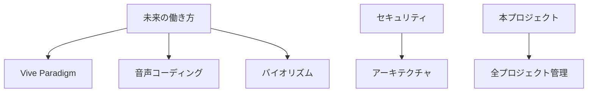

# WD132_project-vitality-system

## 🎯 プロジェクト概要
プロジェクト活性化・継続性維持システム - 「思いつきで終わらせない」ための仕組み

## 🔥 解決する課題
- 思いつきだけで実装が進まない
- プロジェクトを放り投げてしまう
- GitHubリポジトリが墓場化する

## 📊 主要機能

### 1. ビジュアルREADME標準
```
各プロジェクトに必須：
├── README.md（テキスト）
├── concept.png（概念図）
├── architecture.pdf（設計図）
└── demo.gif（動作イメージ）
```

### 2. プロジェクト健康診断
- 🟢 Active: 7日以内に更新
- 🟡 Sleeping: 30日以内に更新
- 🔴 Abandoned: 30日以上放置
- 💀 Archive候補: 90日以上放置

### 3. 5分タスクシステム
各プロジェクトに「今すぐできる」タスクを常備：
- READMEに1行追加
- 概念図のスケッチ
- 関連リンクの追加
- アイデアメモの記録

### 4. プロジェクト相互作用マップ


## 🚀 実装予定

### Phase 1: 視覚化
- プロジェクトテンプレート作成
- 自動図解生成スクリプト
- スクリーンショット管理

### Phase 2: 自動化
- GitHub Actions連携
- 放置アラート実装
- Discord通知統合

### Phase 3: AI支援
- プロジェクト復活提案
- 関連性の自動発見
- モチベーション維持

## 💡 使い方
1. 新規プロジェクト作成時にテンプレート適用
2. 週次でプロジェクト健康診断実行
3. Discordで「今日のプロジェクト」提案受信
4. 5分タスクで小さな進捗を積み重ね

## 🎨 ビジュアル要素の重要性
- 記憶に残る概念図
- 一目で分かる進捗
- 感情的なつながり形成

## 関連プロジェクト
- 全WDプロジェクト（管理対象）
- WD122_discord-multiagent-control（通知連携）

## 作成日
2025年7月25日

---
💭 *「アイデアの墓場」から「アイデアの庭園」へ*