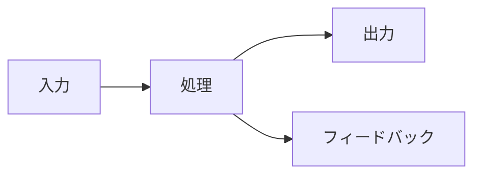

# [プロジェクト名]

## 📸 ビジュアルサマリー

*一目で分かるプロジェクトの全体像*

## 🎯 これは何？
[1-2行でプロジェクトの本質を説明]

## 💡 なぜ作るの？
[解決したい課題や実現したい夢を視覚的に]

## 🚀 動作イメージ

*実際の動作や期待される結果*

## 📊 アーキテクチャ

## ✅ 今すぐできる5分タスク
- [ ] 概念図のラフスケッチを追加
- [ ] 関連プロジェクトをリストアップ
- [ ] 使用シーンを1つ追加
- [ ] 技術スタックを1つ調査
- [ ] インスピレーション元を記録

## 🔗 関連プロジェクト
- [関連プロジェクト1]
- [関連プロジェクト2]

## 📈 進捗状況
- 構想: ████████░░ 80%
- 設計: ██░░░░░░░░ 20%
- 実装: ░░░░░░░░░░ 0%

## 💭 アイデアメモ
[思いついたことを気軽に追記]

---
最終更新: [日付]
健康状態: 🟢 Active